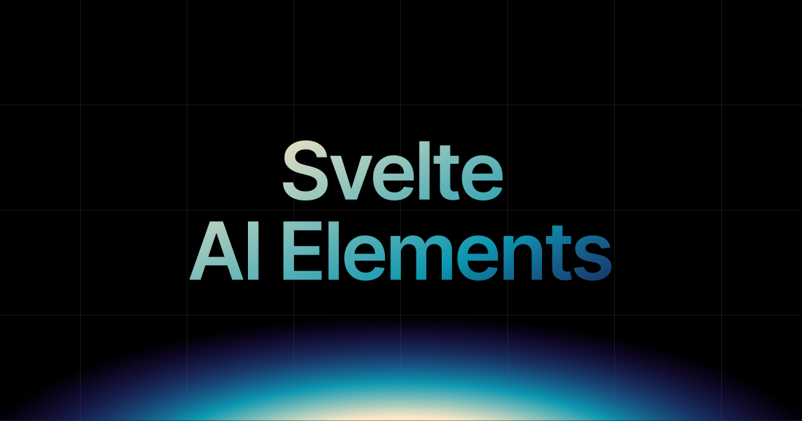

# Svelte AI Elements

<div align="center">
  
</div>

<div align="center">

[](https://jsrepo.com/@ai/elements)
[](https://jsrepo.dev/registry?url=@ai/elements)
[](https://choosealicense.com/licenses/mit/)

</div>

<div align="center">
  <p>
    <a href="https://svelte-ai-elements.vercel.app">Website</a> •
    <a href="https://svelte-ai-elements.vercel.app/docs/installation">Documentation</a> •
    <a href="https://svelte-ai-elements.vercel.app/playground">Playground</a> •
    <a href="https://github.com/SikandarJODD/ai-elements/issues">Issues</a>
  </p>
</div>

---

## Overview

**Svelte AI Elements** is a comprehensive component registry built on top of [shadcn-svelte](https://www.shadcn-svelte.com/) that provides **44+ production-ready components** specifically designed for building AI-powered applications with Svelte and SvelteKit.

### Two Component Libraries

1. **AI Elements** (27 components) - Full-featured components for complete AI applications
2. **Prompt Kit** (17 components) - Lightweight components for prompt engineering interfaces

---

## ✨ Key Features

- **Beautiful Design** - Built on shadcn-svelte with modern, accessible UI
- **Highly Customizable** - Easily modify components to match your brand
- **Responsive** - Works seamlessly across desktop and mobile devices
- **Accessible** - Built with accessibility best practices (ARIA, keyboard navigation)
- **TypeScript Ready** - Full TypeScript support with comprehensive type definitions
- **AI SDK Integration** - Seamless integration with [Vercel AI SDK](https://sdk.vercel.ai/)
- **Copy Markdown** - All component pages include "Copy Markdown" feature
- **Open In** - Share prompts directly to ChatGPT, Claude, V0, and other AI platforms
- **8 UI Blocks** - Pre-built blocks for rapid development

---

## Quick Start

### Prerequisites

Before installing Svelte AI Elements, ensure you have:

- **Node.js** 18 or later
- **SvelteKit** project set up
- **shadcn-svelte** configured in your project

### 1. Install shadcn-svelte

```bash
npx shadcn-svelte@latest init
```

### 2. Install AI SDK (Optional but Recommended)

```bash
pnpm add ai @ai-sdk/svelte
```

### 3. Install Components

Choose your preferred installation method:

#### Option A: Using shadcn-svelte CLI (Recommended)

**Component Registry Structure:**

- **AI Elements**: `/r/[component-name].json` (r = ai-elements)
- **Prompt Kit**: `/p/[component-name].json` (p = prompt-kit)

```bash
# Install AI Elements components
npx shadcn-svelte@latest add https://svelte-ai-elements.vercel.app/r/message.json
npx shadcn-svelte@latest add https://svelte-ai-elements.vercel.app/r/conversation.json

# Install Prompt Kit components
npx shadcn-svelte@latest add https://svelte-ai-elements.vercel.app/p/prompt-input.json
npx shadcn-svelte@latest add https://svelte-ai-elements.vercel.app/p/message.json
```

#### Option B: Using JSRepo

```bash
# Install JSRepo CLI globally
pnpm add -g jsrepo

# Initialize the AI Elements registry
jsrepo init @ai/elements

# Install specific components
jsrepo add @ai/elements/ai-elements/message
jsrepo add @ai/elements/ai-elements/conversation
jsrepo add @ai/elements/ai-elements/prompt-input
```

---

## Component Catalog

### AI Elements Components (29)

#### Core Chat Components

- **Message** - Chat message display with avatar and content
- **Conversation** - Structured chat conversation container
- **Prompt Input** - Advanced prompt input with file attachments, drag-drop, model selection
- **Response** - Structured AI response container with markdown support
- **Actions** - Action buttons for AI responses (retry, like, dislike, copy, share)

#### AI Features

- **Reasoning** - Display AI reasoning process with collapsible content
- **Chain of Thought** - Visual step-by-step AI reasoning with search results
- **Tool** - Display AI tool execution with parameters and results
- **Task** - Structured task display with progress indicators
- **Sources** - Collapsible source citations and references
- **Inline Citation** - In-text citations with tooltips
- **Checkpoint** - Mark conversation history points for restoration
- **Confirmation** - Request user approval before executing sensitive AI actions

#### Content Display

- **Code** - Syntax-highlighted code blocks with copy button
- **Artifact** - Container for generated content (code, documents)
- **Image** - AI-generated image display from base64 data
- **Web Preview** - Interactive web browser interface with console

#### UI Components

- **Suggestion** - Interactive prompt suggestions
- **Loader** - Loading indicators for AI responses
- **Copy Button** - Copy-to-clipboard with visual feedback
- **Open In Chat** - Share to ChatGPT, Claude, V0, etc.
- **Context** - Display token usage and model metrics

#### Workflow Components (8)

- **Canvas** - Main workflow diagram container
- **Node** - Workflow step nodes with customizable content
- **Edge** - Animated and temporary connection edges
- **Connection** - Connection line preview during dragging
- **Controls** - Zoom and navigation controls
- **Panel** - Overlay panel for workflow information
- **Toolbar** - Node action toolbar on hover

#### Special

- **Playground** - Complete AI chat playground with OpenRouter integration

### Prompt Kit Components (17)

#### Input & Interaction

- **Prompt Input** - Comprehensive text input with actions and state management
- **Prompt Suggestion** - Clickable prompt suggestions with icons
- **File Upload** - Drag-and-drop file upload with preview
- **Chat Container** - Chat interface with scroll management and auto-scrolling

#### Display Components

- **Message** - Chat messages with avatar, content, and actions
- **Code Block** - Syntax-highlighted code with copy functionality
- **Markdown** - Render markdown content with proper styling
- **Image** - Image display with zoom and fullscreen
- **System Message** - System-level notifications and status

#### AI Features

- **Chain of Thought** - Step-by-step reasoning display with collapsible steps
- **Reasoning** - AI thinking process with collapsible content
- **Tool** - Tool execution information with parameters and results
- **Source** - Collapsible source information and citations
- **Steps** - Visual step-by-step progress indicator

#### UI Utilities

- **Loader** - 13 different animated loading indicators
- **Scroll Button** - Floating scroll-to-bottom button
- **Copy Button** - Copy text with visual feedback

---

## 8 Pre-built UI Blocks

Accelerate your development with ready-to-use UI blocks:

1. **Prompt Input with Actions** - Input field with action buttons
2. **Prompt Input with Suggestions** - Input with clickable suggestions
3. **Prompt Input with Autocomplete** - Input with autocomplete functionality
4. **Basic Full Conversation** - Simple conversation layout
5. **Conversation with Avatars** - Conversation with user/AI avatars
6. **Conversation with Actions** - Conversation with message actions
7. **Advanced Conversation Layout** - Complex conversation interface
8. **Multi-step Conversation Flow** - Step-by-step conversation

**Access blocks at:** [https://svelte-ai-elements.vercel.app/prompt-kit/blocks](https://svelte-ai-elements.vercel.app/prompt-kit/blocks)

---

## Usage with Vercel AI SDK

### Basic Chat Interface

```svelte
<script lang="ts">
  import { Chat } from "@ai-sdk/svelte";
  import {
    Message,
    MessageContent,
  } from "$lib/components/ai-elements/message";
  import {
    Conversation,
    ConversationContent,
  } from "$lib/components/ai-elements/conversation";
  import {
    PromptInput,
    PromptInputBody,
    PromptInputTextarea,
    PromptInputToolbar,
    PromptInputSubmit,
    type PromptInputMessage,
  } from "$lib/components/ai-elements/prompt-input";
  import { Response } from "$lib/components/ai-elements/response";

  let input = $state("");
  const chat = new Chat({});

  function handleSubmit(message: PromptInputMessage, event: SubmitEvent) {
    event.preventDefault();
    if (message.text?.trim()) {
      chat.sendMessage({ text: message.text });
      input = "";
    }
  }
</script>

<Conversation>
  <ConversationContent>
    {#each chat.messages as message, messageIndex (messageIndex)}
      <Message from={message.role}>
        <MessageContent>
          {#each message.parts as part, partIndex (partIndex)}
            {#if part.type === "text"}
              <Response content={part.text} />
            {/if}
          {/each}
        </MessageContent>
      </Message>
    {/each}
  </ConversationContent>
</Conversation>

<PromptInput onSubmit={handleSubmit}>
  <PromptInputBody>
    <PromptInputTextarea bind:value={input} placeholder="Ask me anything..." />
  </PromptInputBody>
  <PromptInputToolbar>
    <PromptInputSubmit />
  </PromptInputToolbar>
</PromptInput>
```

### With Reasoning

```svelte
<script lang="ts">
  import { Chat } from "@ai-sdk/svelte";
  import {
    Message,
    MessageContent,
  } from "$lib/components/ai-elements/message";
  import {
    Conversation,
    ConversationContent,
  } from "$lib/components/ai-elements/conversation";
  import { Response } from "$lib/components/ai-elements/response";
  import { Reasoning } from "$lib/components/ai-elements/reasoning";
  import {
    PromptInput,
    PromptInputBody,
    PromptInputTextarea,
    PromptInputToolbar,
    PromptInputSubmit,
    type PromptInputMessage,
  } from "$lib/components/ai-elements/prompt-input";

  let input = $state("");
  const chat = new Chat({ api: "/api/chat" });

  function handleSubmit(message: PromptInputMessage, event: SubmitEvent) {
    event.preventDefault();
    if (message.text?.trim()) {
      chat.sendMessage({ text: message.text });
      input = "";
    }
  }
</script>

<Conversation>
  <ConversationContent>
    {#each chat.messages as message, messageIndex (messageIndex)}
      <Message from={message.role}>
        <MessageContent>
          {#each message.parts as part, partIndex (partIndex)}
            {#if part.type === "reasoning"}
              <Reasoning content={part.reasoning} />
            {:else if part.type === "text"}
              <Response content={part.text} />
            {/if}
          {/each}
        </MessageContent>
      </Message>
    {/each}
  </ConversationContent>
</Conversation>

<PromptInput onSubmit={handleSubmit}>
  <PromptInputBody>
    <PromptInputTextarea bind:value={input} placeholder="Ask me anything..." />
  </PromptInputBody>
  <PromptInputToolbar>
    <PromptInputSubmit />
  </PromptInputToolbar>
</PromptInput>
```

### Complete Example with Actions

```svelte
<script lang="ts">
  import { Chat } from "@ai-sdk/svelte";
  import {
    Conversation,
    ConversationContent,
  } from "$lib/components/ai-elements/conversation";
  import {
    Message,
    MessageContent,
  } from "$lib/components/ai-elements/message";
  import {
    PromptInput,
    PromptInputBody,
    PromptInputTextarea,
    PromptInputToolbar,
    PromptInputSubmit,
    type PromptInputMessage,
  } from "$lib/components/ai-elements/prompt-input";
  import { Response } from "$lib/components/ai-elements/response";
  import { Actions, Action } from "$lib/components/ai-elements/action";

  let input = $state("");
  const chat = new Chat({ api: "/api/chat" });

  function handleSubmit(message: PromptInputMessage, event: SubmitEvent) {
    event.preventDefault();
    if (message.text?.trim()) {
      chat.sendMessage({ text: message.text });
      input = "";
    }
  }

  function copyMessage(text: string) {
    navigator.clipboard.writeText(text);
  }
</script>

<Conversation>
  <ConversationContent>
    {#each chat.messages as message, messageIndex (messageIndex)}
      <Message from={message.role}>
        <MessageContent>
          {#each message.parts as part, partIndex (partIndex)}
            {#if part.type === "text"}
              <Response content={part.text} />
            {/if}
          {/each}
        </MessageContent>
        {#if message.role === "assistant"}
          <Actions>
            <Action
              icon="copy"
              onclick={() => {
                const textPart = message.parts.find((p) => p.type === "text");
                if (textPart && textPart.type === "text") {
                  copyMessage(textPart.text);
                }
              }}
            />
            <Action icon="refresh" onclick={() => chat.regenerate()} />
          </Actions>
        {/if}
      </Message>
    {/each}
  </ConversationContent>
</Conversation>

<PromptInput onSubmit={handleSubmit}>
  <PromptInputBody>
    <PromptInputTextarea bind:value={input} placeholder="Ask me anything..." />
  </PromptInputBody>
  <PromptInputToolbar>
    <PromptInputSubmit />
  </PromptInputToolbar>
</PromptInput>
```

### Backend API Route

Create `src/routes/api/chat/+server.ts`:

```typescript
import { streamText, type UIMessage, convertToModelMessages } from "ai";
import { createOpenAI } from "@ai-sdk/openai";
import type { RequestHandler } from "./$types";

const openai = createOpenAI({
  apiKey: process.env.OPENAI_API_KEY,
});

export const POST: RequestHandler = async ({ request }) => {
  const { messages }: { messages: UIMessage[] } = await request.json();

  const result = streamText({
    model: openai("gpt-4o"),
    messages: convertToModelMessages(messages),
  });

  return result.toUIMessageStreamResponse();
};
```

---

## Resources

### Documentation

- **[Installation Guide](https://svelte-ai-elements.vercel.app/docs/installation)** - Complete setup instructions
- **[Component Documentation](https://svelte-ai-elements.vercel.app/docs/introduction)** - Detailed component docs

### Guides

- **[Basic Setup Guide](https://svelte-ai-elements.vercel.app/guides/basic-setup)** - Get started in 10 minutes
- **[Svelte 5 + AI SDK Integration](https://svelte-ai-elements.vercel.app/guides/svelte-5-ai-sdk-integration)** - Master Svelte 5 runes with AI SDK

### Live Examples

- **[Playground](https://svelte-ai-elements.vercel.app/playground)** - Interactive playground with free AI model
- **[UI Blocks](https://svelte-ai-elements.vercel.app/prompt-kit/blocks)** - Pre-built UI blocks

---

## Technology Stack

- **Framework**: [Svelte 5](https://svelte.dev/) + [SvelteKit](https://kit.svelte.dev/)
- **UI Foundation**: [shadcn-svelte](https://www.shadcn-svelte.com/)
- **Styling**: [Tailwind CSS v4](https://tailwindcss.com/)
- **AI Integration**: [Vercel AI SDK](https://sdk.vercel.ai/)
- **Type Safety**: [TypeScript](https://www.typescriptlang.org/)
- **State Management**: Svelte 5 runes + [runed](https://runed.dev/)
- **Code Highlighting**: [Shiki](https://shiki.style/)
- **Markdown**: [marked](https://marked.js.org/) + [isomorphic-dompurify](https://www.npmjs.com/package/isomorphic-dompurify)
- **Workflow**: [@xyflow/svelte](https://svelteflow.dev/)

---

## License

This project is licensed under the MIT License - see the [LICENSE](LICENSE) file for details.

---

## 💖 Support

If you find Svelte AI Elements helpful, please consider supporting the project:

### Financial Support

<a href="https://github.com/sponsors/SikandarJODD" target="_blank">
  
</a>

Your sponsorship helps maintain and improve Svelte AI Elements, add new components, and keep the project free and open-source for everyone.

### Share the Love

Help spread the word about Svelte AI Elements:

- **Star the repository** on [GitHub](https://github.com/SikandarJODD/ai-elements)
- **Share on Twitter/X**: "Building AI apps with @SvelteJS just got easier with Svelte AI Elements! 44+ production-ready components for AI interfaces. Check it out: https://svelte-ai-elements.vercel.app"
- **Share on LinkedIn**: Post about how you're using Svelte AI Elements in your projects
- **Write a blog post** or tutorial about your experience
- **Create a video** showcasing the components
- **Recommend it** to your developer friends and communities

Every share, star, and mention helps the project grow and reach more developers! 🚀

---

## 🙏 Acknowledgments

This project draws inspiration from several excellent projects:

- **[shadcn-svelte](https://www.shadcn-svelte.com/)** - UI component foundation
- **[shadcn-svelte-extras](https://www.shadcn-svelte-extras.com)** - Additional components and utilities
- **[Vercel AI Elements](https://vercel.com/changelog/introducing-ai-elements)** - AI component concepts
- **[Prompt Kit](https://www.prompt-kit.com)** - Beautiful AI UI components

---

<div align="center">
  <p>Made with ❤️ by <a href="https://github.com/SikandarJODD">Sikandar Bhide (Bhide Svelte)</a></p>
  <p>
    <a href="https://svelte-ai-elements.vercel.app">Website</a> •
    <a href="https://svelte-ai-elements.vercel.app/docs/installation">Documentation</a> •
    <a href="https://svelte-ai-elements.vercel.app/playground">Playground</a> •
    <a href="https://github.com/SikandarJODD/ai-elements">GitHub</a> •
    <a href="https://github.com/SikandarJODD/ai-elements/issues">Issues</a>
  </p>
</div>
