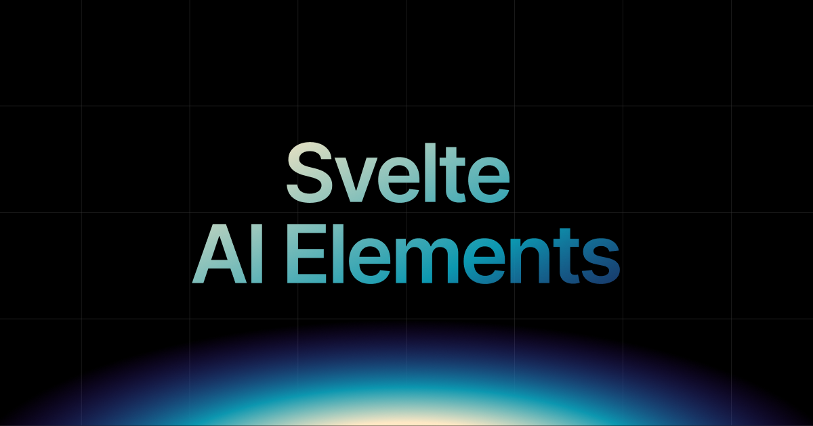

# Svelte AI Elements

  

  

    <a href="https://svelte-ai-elements.vercel.app">Website</a> |
    <a href="https://svelte-ai-elements.vercel.app/docs/introduction">Documentation</a> |
    <a href="https://svelte-ai-elements.vercel.app/playground">Playground</a> |
    <a href="https://github.com/SikandarJODD/ai-elements/issues">Issues</a>
  

## Overview

**Svelte AI Elements** is a developer-focused component registry for building AI-native interfaces with **Svelte** and **SvelteKit**. It is built on top of [shadcn-svelte](https://www.shadcn-svelte.com/) and includes two libraries: **AI Elements** for richer production-ready AI UI patterns, and **Prompt Kit** for lightweight prompt and chat interfaces.

## Libraries

### AI Elements

Full-featured components for chat apps, streaming responses, reasoning UIs, tools, and workflow-style AI interfaces.

- Docs: https://svelte-ai-elements.vercel.app/components
- Registry: https://svelte-ai-elements.vercel.app/r/index.json

### Prompt Kit

Lightweight prompt engineering and conversational UI components that are easy to compose into simple AI interfaces.

- Docs: https://svelte-ai-elements.vercel.app/prompt-kit
- Registry: https://svelte-ai-elements.vercel.app/p/index.json

## Most Used Components

### AI Elements

| Component | What it helps with |
| --- | --- |
| `Message` | Role-based chat messages and response layout |
| `Prompt Input` | Prompt submission with AI-focused input controls |
| `Conversation` | Scrollable conversation containers and chat structure |
| `Response` | Streaming markdown response rendering |
| `Reasoning` | Expandable AI thinking and reasoning views |
| `Tool` | Tool call input/output presentation |

### Prompt Kit

| Component | What it helps with |
| --- | --- |
| `Message` | Lightweight assistant and user message UI |
| `Prompt Input` | Chat-style prompt input with actions |
| `Chat Container` | Sticky-to-bottom chat layout and scrolling |
| `Markdown` | Render streamed markdown responses |
| `Prompt Suggestion` | Clickable starter prompts and suggestions |
| `System Message` | Inline status, warning, and helper messages |

## 8 Prompt Kit UI Blocks

Prompt Kit also includes eight ready-to-use UI blocks for faster composition. Browse them here: https://svelte-ai-elements.vercel.app/prompt-kit/blocks

- `Prompt Input with Actions`
- `Prompt Input with Suggestions`
- `Prompt Input with Autocomplete`
- `Basic Full Conversation`
- `Conversation with Avatars`
- `Conversation with Actions`
- `Conversation with Scroll`
- `Conversation with Prompt Input`

## Streaming Responses

For markdown and streaming response rendering, this project uses [`svelte-streamdown`](https://github.com/beynar/svelte-streamdown), the Svelte port used throughout the repo for streamed markdown output.

## Inspired By

- [Vercel AI Elements](https://vercel.com/changelog/introducing-ai-elements)
- [ibelick/prompt-kit](https://github.com/ibelick/prompt-kit)

## License

This project is licensed under the MIT License. See [LICENSE](LICENSE) for details.

  
Made with 😊 by <a href="https://x.com/Sikandar_Bhide">Bhide Svelte</a>

